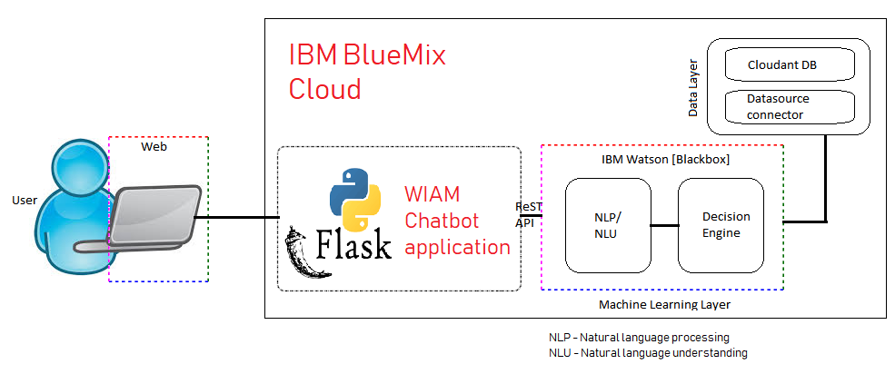

# WIAM ChatBot #

__Team Name__ : Bangalore Rockers

__Team Members__ : 
1. Abirami Sivaramakrishnan
2. Rajgopal Chundekat

__Chatbot title__ : WIAM Chatbot

__Inspiration__ : We want to serve our customers better, by leveraging the Machine Learning and Natural language processing abilities of IBM Watson.

__Solution description__ :

The WIAM chatbot allows a user to :

:white_check_mark: raise role requests

:white_check_mark: check current status of their requests

:white_check_mark: provide feedback on WIAM

The chatbot makes the entire process very __interactive__ and __intutive__. The feedback is not just collected but also analyzed in real-time using IBM Watson __Tone Analyzer__ API to understand the __emotion__ (happy,sad,frustrated,angry etc) behind. The feedback consolidated from all the users, can then be made available as a Dashboard to the management, to enable decisions.

The solution is designed to scale and is deployed on the IBM's bluemix cloud platform. Below is a high-level overview of the solution design :

__Built with__ :

:small_blue_diamond: IBM Watson Assistant

:small_blue_diamond: IBM Watson Tone Analyzer

:small_blue_diamond: IBM Cloudant database

:small_blue_diamond: Python

:small_blue_diamond: Flask

:small_blue_diamond: Postman (to test ReST API calls)

__Actors__ :
1. RBS internal users
2. WIAM chatbot

__Accomplishment__ : This chatbot helps us solve a problem we currently have in WIAM. We, at WIAM, want to capture user's feedback to see how we can improve. Capturing the feedback can be built into any web-application. But this chatbot works hand-in-hand with IBM Watson's Tone Analyzer API. Along with capturing feedback, it understands/derives the emotion in that feedback. The level of joy,anger or frustration can be obtained. This real-time information can be displayed as a dashboard to management, to help in their decisions. Thus helping us serve our customers better.

__What I learnt__ : 

:small_blue_diamond: Fundamentals of natural language processing

:small_blue_diamond: Developing and deploying in Cloud

:small_blue_diamond: Agile development

__Challenges__ :

:small_blue_diamond: steep learning curve

:small_blue_diamond: restrictions in office network and software downloads

:small_blue_diamond: Limited time to learn/understand the APIs well.

__What's next__ :

:small_blue_diamond: Demo this to our line managers and business stakeholders 

:small_blue_diamond: Improve the chatbot

:small_blue_diamond: come up with a plan to deploy this to few RBS users and evaluate

__Try it out__ :

link will be provided here.
